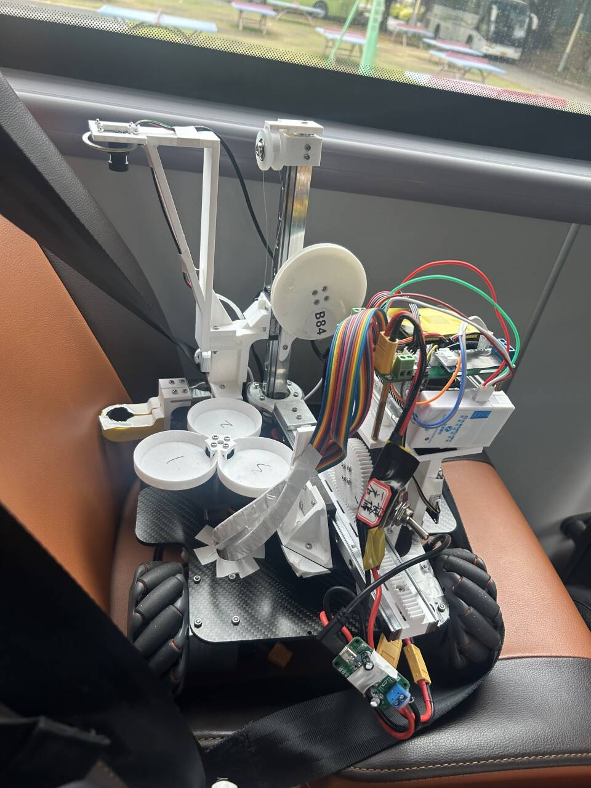

# 智能物流搬运小车

## 概述
- 本工程是2025中国大学生工程实践与创新能力大赛中“智能+”赛道的智能物流搬运赛项的物流搬运小车中的电控部分。  
- 采用STM32F407Vet6（反客科技开发板）作为主控，基于CubeMX生成工程，使用HAL库函数和Keil5配合vscode进行开发（当然其实后期cursor修改和gemini问答起到了很大作用）
- 小车底盘为张大头42步进电机配合大疆麦轮及黄铜联轴器，夹爪相关部分采用飞特SM45BL总线舵机、MG996R数字舵机进行控制。底板为碳纤维板，电机支架、夹爪臂的部分结构为金属加工材质（成本很高），其余部分为3D打印件
- 自行设计了STM32的控制拓展板（采用24V的XT60接口航模电池作为电源输入，配合亿佰特锐DM21-25W050S贴片降压模块实现5V的供电，配合贴片TTL转485模块实现了STM32串口信号转为485信号对飞特舵机的控制，采用遥控继电器实现了远程开关，在开发板接口接入了正点原子高速无线调试器，实现了远程烧录和调试）
- 实现功能为：底盘给定距离（厘米）的全向移动以及移动时间自动计算、根据圆环和直线校正底盘的前后左右偏差及角度偏差、从转盘上抓取物料（可以在车身前后左右有一定偏差的情况下保证不抓空并且带有抓空的视觉二次判断）、夹着/不夹着物料在暂存区和粗加工区进行调整并实现95%以上的1环率放置/码垛、在旋转的转盘上放置物料到对应颜色的色环里、从暂存区地上按照任务顺序要求夹取随机位置摆放的物料、根据陀螺仪配合底盘角度位置实现位置闭环（后续未采用）等
- 广东省赛初赛第4，决赛第11
- 视觉部分的代码（不一定是最新的）：[OpenCV](https://github.com/summersummer33/opencv)

## 演示和展示

省赛版本

省赛决赛现场（只放了一个）

国赛版本

国赛车核心控制组件（拓展板、调试器、继电器）

## 视觉队友
Collaborators:[summersummer33](https://github.com/summersummer33)

## 工程结构
- [CCC_crazy_carrier_car](./CCC_crazy_carrier_car): 项目的主程序代码工程
    - [motor_control](./CCC_crazy_carrier_car/motor_control): 底盘运动控制进行功能实现和封装
    - [screen](./CCC_crazy_carrier_car/screen): 串口屏相关（基本弃用，直接用串口发送数据即可）
    - [sensor](./CCC_crazy_carrier_car/sensor): 传感器相关（hwt101陀螺仪相关）
    - [servo](./CCC_crazy_carrier_car/servo): 飞特舵机和数字舵机相关驱动，核心动作函数在my_servo.c中
    - [Core](./CCC_crazy_carrier_car/Core): 主程序代码main.c所在，核心功能函数所在（包含从转盘抓取、色环放置、转盘放置等功能）
    - 其余文件夹和文件为CubeMX生成的相关工程文件
- [OpenCV](./OpenCV): 项目的图像处理代码工程，基于树莓派，使用OpenCV

## 使用注意和名词解释
- 在main.c中封装了从新物料抓取测试到各种功能实现的函数，可以根据任务功能需要进行调用
- 推荐使用vscode的better comments插件，本工程中有很多特殊高亮注释可以通过该插件查看，便于理解代码
- 在mian.c中有大量的参数，主要是需要根据功能进行修改和调整的参数，重要参数都添加了注释和说明。在my_servo.c中也有大量的参数，主要是舵机的位置参数，需要根据实际情况进行修改

- 在一些夹爪臂动作函数中出现了avoid字样，即夹爪在完成了将物料放置在载物盘上时，不能直接从物料上方转回去（因为爪子底部在转回去的过程中会碰到物料），因此需要将爪子张开到最大后从物料的侧面过去（不是很好描述，主要是受限于车的机械结构）
- 代码中有arm_shrink()和arm_stretch()函数，即夹爪的伸缩，注意此处的伸缩和函数名并不是直接对应
- 需要注意电机和舵机的ID号对应关系。

## 控制思路和逻辑

#### 整体的控制逻辑梳理
**综述：** 总体就是在main函数中执行各个动作，在定时器中断(`my_timer.c`)和串口相关(`my_usart.c`)中进行串口的通信与数据的传输等

比赛的决定性因素：
- 底盘位置移动的控制：主要是精度，无论是开环跑直线还是根据视觉进行微调，都对底盘的操纵性提出了很高的要求。
- 视觉识别的准确度和速度：在比赛环境下，可能会有不同的光照条件甚至阴影，对于颜色识别的干扰可能很大。同时，识别的速度也要越快越好，减少时间
- 放置物料和抓取物料的动作速度：尽量做到连续抓取和放置，减少时间，同时保证放置的精度
- 夹爪的设计：一个好的夹爪在能保证稳定夹取的同时还能不让物料在夹爪臂移动的过程中产生晃动或者影响视觉的识别

**比赛分析：**
初赛：
- 由于是给定题目的，所以核心就是在尽量保证放置精度的情况下提升速度，从而得到更多的分数
- 要考虑到光照条件、物料重量等环境因素，还要做好各种器件的备用件和预案（比如夹爪断了、主控板烧了、VNC连接不上等）

决赛：

- 决赛题目会有变化，所以需要提前准备好各种功能函数的实现，到时候直接调用然后写改逻辑即可
- 机械部分负责人需要提前练习夹爪的绘制，在创新实践环节能快速画出一个好用的爪子

<!-- 

#### 比赛整体流程

1红 2绿 3蓝

##### 启动
- 展开：
- 出库：需要测试出库的角度、是否需要转向，是否需要陀螺仪辅助定位和初始化等

##### 二维码识别和任务获得
- 前往二维码：需要测试从完成出库的位置到二维码的位置的距离，前往二维码识别区域（此处无需精确定位）
- 二维码识别：需要发送开始识别的信号给树莓派，开始识别并返回识别的结果，测试识别的速度和准确度，在屏幕上显示顺序码

##### 原料区搬运（第一批）
- 前往原料区：需要测试从二维码到原料区的距离，还需要整车转向，夹爪朝向原料盘（或者可以考虑出库时就转向）
- 原料盘精确定位：根据视觉识别，确定原料盘的中心，并调整车的位置
- 颜色识别与夹取：根据任务的顺序识别原料的颜色，当对应颜色到位时，树莓派发送信息，夹爪开始夹取，执行完毕后继续识别并夹取（此处需要考虑单次夹取和放置并归位的时间，尽量做到连续夹取）

##### 粗加工区搬运和夹取（第一批）
- 前往粗加工区：三个物料夹取完后，前往粗加工区，一样需要测试时间和距离
- 粗加工区精确定位：到达大致位置时，借助视觉进行微调定位
- 放置原料：按照顺序放置（视底盘旋转的情况和电机移动的情况决定是原地一次性完成三个物料的放置还是移动分别完成，还要考虑是否需要视觉辅助闭环反馈校正）

##### 暂存区放置（第一批）
- 夹取：把粗加工区的物料夹取，放置在载物盘上
- 前往暂存区：需要测试距离，还要考虑转向等问题
- 暂存区识别定位：到达大致位置后借助视觉进行微调
- 放置原料：按照顺序放置（要考虑的同上）
  
##### 原料区搬运（第二批）
- 返回原料区：从暂存区返回原料区，需要测试移动的距离，还需要整车的旋转等
- 原料盘精确定位：根据视觉识别，确定原料盘的中心，并调整车的位置
- 颜色识别与夹取：根据任务的顺序识别原料的颜色，当对应颜色到位时，树莓派发送信息，夹爪开始夹取，执行完毕后继续识别并夹取（此处需要考虑单次夹取和放置并归位的时间，尽量做到连续夹取）

##### 粗加工区搬运和夹取（第二批）
- 前往粗加工区：三个物料夹取完后，前往粗加工区，一样需要测试时间和距离
- 粗加工区精确定位：到达大致位置时，借助视觉进行微调定位
- 放置原料：按照顺序放置（要求同上）

##### 暂存区放置（第二批）
- 夹取：把粗加工区的物料夹取，放置在载物盘上
- 前往暂存区：需要测试距离，还要考虑转向等问题
- 暂存区识别定位：到达大致位置后借助视觉进行微调
- 放置原料：按照顺序放置（码垛放置，颜色相同）

##### 返回和结束
- 回到起停区：考虑是否需要旋转，如何入库（需要考虑总时间，需要在3分钟内完成） -->

#### 各自模块和功能的逻辑实现
主要参见各个模块下对应的README.md文件

## 任务和灵感

#### 国赛任务和优化方向

**程序工程结构的优化**

已完成
- 转盘两轮、放置第四轮的标志位由32控制
- 基本完成各种参数的管理，主要是将各种常调的参数进行了统一管理，这样调参和改代码会方便一点
- 将路径的delay融入到move_all_direction_position中，根据不同的标志位决定是否需要额外delay
- 搞定keil的调试环境，查看问题和执行情况
- 将各种可能的决赛功能函数进行封装和管理
- 将单独路径测试、抓取放置测试等写成函数进行快速调用和切换（已完成单独路径配合底盘校正的快速切换，抓取放置、转盘抓取、转盘放置的单独功能切换，还需要完成：从地上抓取随机顺序物料）

未完成
- 将各种参数改为相对值，就是计算出相差值主要是一号舵机的从地面抓取和从载物盘抓取（夹爪上下舵机和左中右位置的实现
- 常用值的测量（上升舵机的一个90°对应多少位置）（上升下降实际距离对应的脉冲数）
- 物料地面位置和载物盘位置的差值给出常量
- 树莓派偏差数据实时画图显示

**实际功能的优化**

已完成
- 动作速度的提升
- 树莓派识别加入滤波
- 视觉识别去掉串口收发0.1、去掉所有grab、摄像头缓存区变成1 
- 加入对不同顺序颜色的识别（可以快速切换）
- 针对换物料后进行从转盘抓取、将物料放置的动作优化（容易调整加速度和动作速度）
- 将从顶上过和侧边过的程序进行封装，快速切换
- 预放置的位置就尽量准确，这样调几下即可
- 完善舵机运动的程序限位

未完成
- 树莓派和stm32通讯总是有问题（采用空闲中断后仍然有问题）
- 弯道行驶的实现
- 调整时PID算法优化（两个方向上的耦合如何处理）（加入积分项和antiwindup等）
- 在转盘上放置时，如果是色环，容易出问题（提前认为色环停下）

**结构和备份等**

已完成
- 螺母改用尼龙螺母，避免金属螺母
- 采用Y42电机，获得更好的运行效果
- 主控板、各种调试工具的备用件准备
- 加入补光灯，减少光照条件对视觉识别的影响

未完成
- 解决左前轮问题（换轮子）
- 3D打印件的备份

#### 后续的优化方向和思路（留待有缘人）
- 底盘的闭环控制的优化（最终为了底盘稳定性考虑，还是采用了的张大头自带的位置模式控制步进电机），还是可以调参来实现陀螺仪、编码器位置闭环，达到更好的底盘定位效果
- 采用RTOS等方案进行更为高效的任务调度，优化程序的框架（当前程序结构还是有可以优化的地方，可以加入更加规范的传参、减少全局变量使用、进行更清晰的函数封装和模块化）
- 加入更多特殊情况的处理函数（还比如长时间没识别到圆环，或者识别不到位，则强制退出；能在视觉失灵的情况下完成除转盘识别抓取外的全部流程）
- 优化路径移动，比如曲线过弯等
- 跑简单的模型来进行颜色等的识别，增加识别的准确度
- 优化车身结构设计。主要是各种结构的装配非常麻烦，且功能实现会严重受到机械结构影响（比如可以考虑采用多自由度机械臂的方案，这样在转盘上可以直接抓取任意位置的物料，不用傻等）
- 优化拓展板设计，加入诸如运行指示灯、蜂鸣器（用于完成动作的提示）、更多的冗余接口等

## 比赛进度和情况
**准备省赛**

2024.10.8
- 实现了串口屏、树莓派的通信和返回数据的初步处理
- 实现了电机的控制，但是底盘控制仍然有问题
- 实现了普通舵机的控制

2024.10.15
- 主控改回STM32F407vet6
- 实现了底盘的位置控制（移动给定距离、旋转给定角度），能达到毫米级别的控制
- 视觉的识别，能做到识别二维码、圆心等，但抗干扰情况和识别速度有待优化

2024.10.17
- 实现了树莓派和电机的联调，可以实现简单的视觉定位

2024.10.26
- 采用了新的PCB拓展板，加入了STM32的开关、精密舵机的接口等
- 实现了精密舵机的基本控制

2024.11.8
- 重装车后（采用玻纤板），重新调试了各个舵机的参数

2024.11.18
- 重新设计了PCB板
- 引入了z轴陀螺仪

2024.12.5
- 完成了比赛流程的可行性验证，实现了所有要求的功能，但性能指标还有没达到的

2024.12.13
- 能够完成比赛流程，用时6min左右
- 重新焊接了疑似烧毁的开关，并用热熔胶对主控板底部做了绝缘

2025.1.4 
- 完成了比赛流程，用时4min左右，放置的精度有待提高

2025.2.19 
- 完成了视觉闭环放置的全流程

2025.3.25
- 完成了各种功能的调优和封装
- 进行了省赛前的程序测试

2025.3.28
- 确定了省赛初赛的代码

2025.3.29
- 省赛初赛（所用代码见master分支的提交记录）

2025.3.30 
- 省赛决赛（所用代码见master分支的提交记录）

**省赛结束，开始准备国赛（切换到国赛分支）**

2025.5.23
- 重新设计了PCB板，将板子固定在底板下，重新装好了车进行测试

2025.5.25
- 加入了省赛决赛的从地上随机放置的物料进行抓取的功能
- 加入了省赛决赛的将物料放置在对应颜色的转盘位置上的功能

2025.5.29
- 优化了树莓派识别帧率，实现了速度的显著提升

2025.6.4 
- 加入了底盘位置移动的自动延时计算

2025.7.2 
- 更换了三号舵机（即中板旋转舵机，疑似因为没有舵机软件限位导致堵转而烧毁）

2025.7.6
- 修改了底盘定位

2025.7.14
- 修改了底盘控制
- 准备进行国赛模拟和功能准备

2025.7.15
- 完成了新物料测试流程函数的编写

2025.7.19
- 完成了新物料测试流程函数的优化和实际测试，基本满足要求
- 完善了文档

## 经验教训

#### 经验教训
- 改程序尽量注释而不是直接删掉，防止改完后忘了原来代码怎么写的
- 调车经验之谈：上电前务必三思，防止烧器件、忘了调参、忘了关电源等等；不要与一个问题或者故障死磕太久，防止陷入死胡同；最好不要一个人调
- 工程代码的设计在最开始就要进行结构化，防止后期的屎山和混乱
- 初始的机械结构选型务必务必务必务必务必务必务必谨慎，不然到了后期改选型实在困难和痛苦，能用机械结构解决的问题尽量就别通过软件程序解决，不然可能带来巨大的隐患

#### 遇到的问题

##### 软件
- 别问为什么用keil和CubeMX而不用CubeIDE这种明显更现代的平台，问就是祖宗之法不可变
- 大量的粗心错误，包括但不限于：忘记修改或者注释代码；忘记将测试代码改回正式代码；函数调用错误；命名错误
- 混乱的程序，包括但不限于：大量的相近代码没有实现复用，部分流程过于复杂
- 随意的代码管理，包括但不限于：没有及时备份代码；没有使用git进行版本管理导致不记得自己改了什么；代码没有交叉检查和review

##### 硬件
- 硬件PCB设计的不合理：功率和非功率的5V没有分开导致烧板子；拨码开关无法耐受大电流导致的电火花；
- 接线的混乱：很多线缺少外部保护措施和固定装置，容易出现磨损、脱落
- 安全意识不强：缺少疯跑保护措施；缺少短路保护措施导致24V直接短路

##### 机械
- 画图和设计的方法不当：容易缺少实际的测量，有时数据不准
- 结构问题

##### 团队和沟通
- 懂得都懂

##### 调试
- 有线调试器（stlink）实在不方便
- 出现过多次的忘记接线（舵机、串口、电源）和接错线